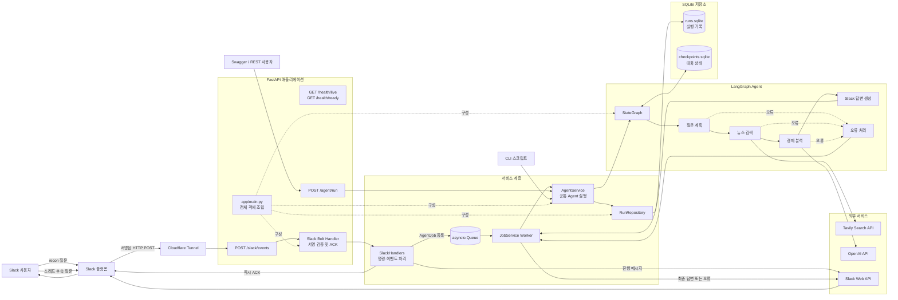
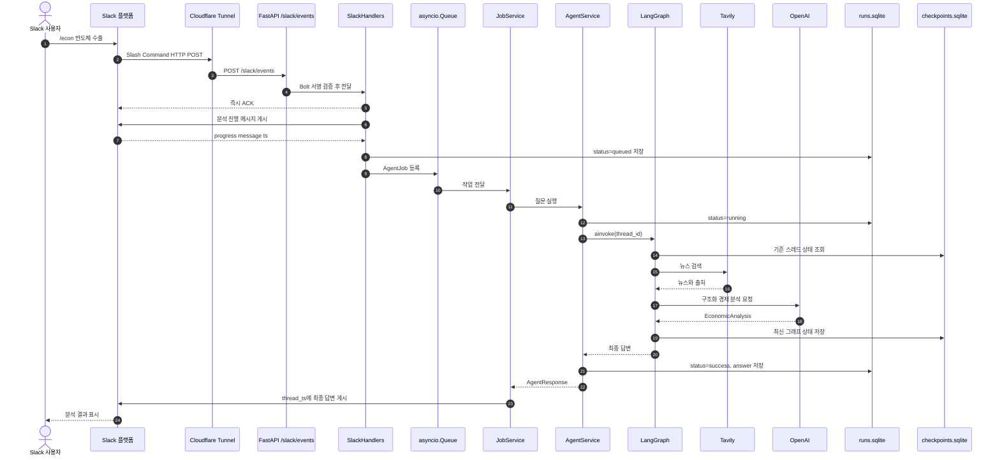
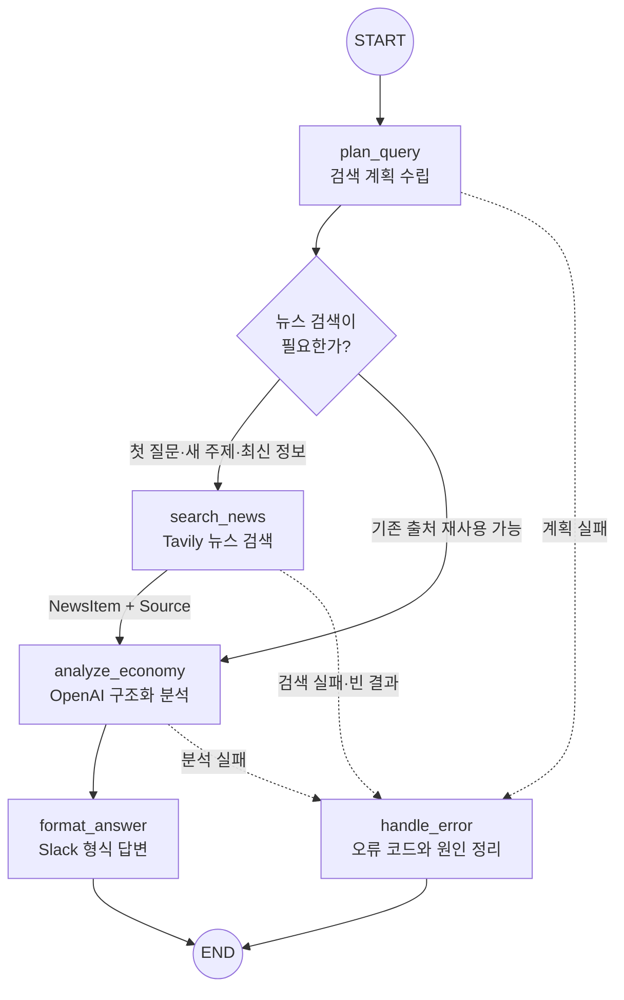
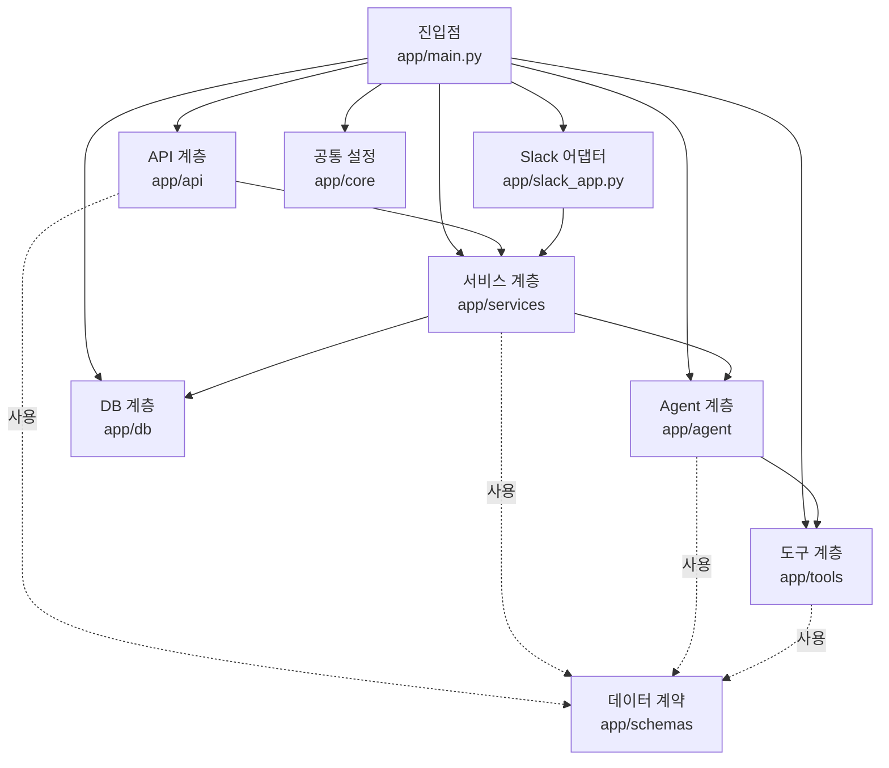
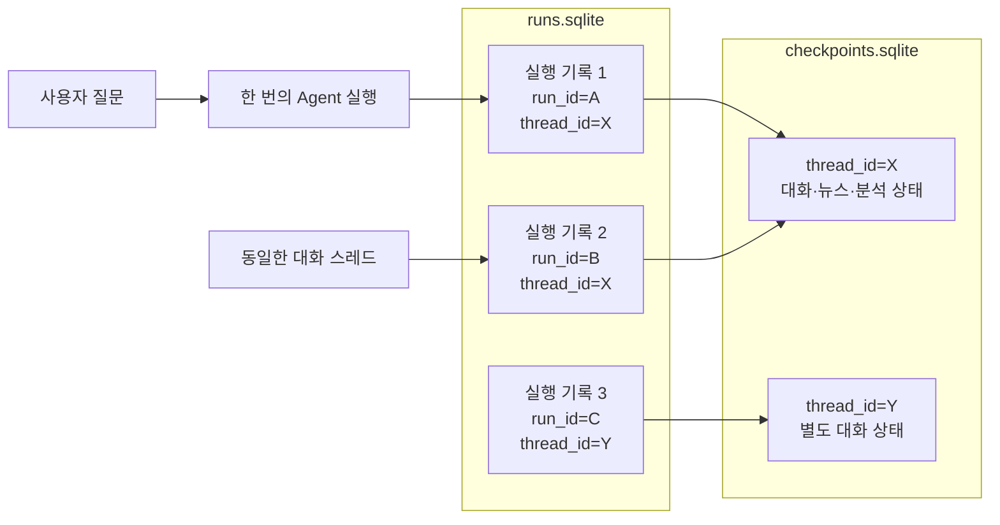

# 전체 아키텍처

이 문서는 Slack 경제 뉴스 챗봇의 런타임 구성, 요청 처리 순서, LangGraph 워크플로, 코드 계층, SQLite 저장 구조와 테스트 구조를 설명합니다.

## 1. 전체 런타임 아키텍처



## 2. Slack 질문 처리 순서



## 3. LangGraph 내부 워크플로



LangGraph가 공유하는 상태는 다음과 같습니다.

```text
AgentState
├─ query
├─ run_id
├─ messages
├─ plan
├─ search_results
├─ analysis
├─ sources
├─ final_answer
└─ error
```

## 4. 코드 계층 구조



각 계층의 책임은 다음과 같습니다.

| 계층 | 주요 파일 | 책임 |
|---|---|---|
| 진입점 | `app/main.py` | 모든 객체 생성과 연결 |
| API | `app/api/*.py` | HTTP 요청과 응답 |
| Slack | `app/slack_app.py` | Slash Command 및 이벤트 등록 |
| 서비스 | `app/services/*.py` | 업무 흐름, 작업 큐, Agent 실행 |
| Agent | `app/agent/*.py` | LangGraph와 OpenAI 분석 |
| 도구 | `app/tools/*.py` | Tavily 뉴스 검색 |
| DB | `app/db/*.py` | 실행 기록 저장 및 조회 |
| 스키마 | `app/schemas/*.py` | 계층 간 데이터 형식 |
| 설정 | `app/core/*.py` | 환경변수와 로깅 |

## 5. SQLite 저장 구조



핵심 차이는 다음과 같습니다.

```text
run_id
= 질문 실행 한 번마다 새로운 값

thread_id
= 같은 대화를 이어갈 때 동일한 값
```

- `runs.sqlite`: 질문별 실행 이력
- `checkpoints.sqlite`: 스레드별 LangGraph 대화 상태

## 6. 핵심 요약

```text
외부 요청 계층
Slack / REST / CLI
        ↓
서비스 계층
SlackHandlers / JobService / AgentService
        ↓
Agent 계층
LangGraph
        ↓
외부 도구
Tavily / OpenAI
        ↓
저장 계층
runs.sqlite / checkpoints.sqlite
        ↓
응답 계층
Slack 스레드 / REST 응답 / CLI 출력
```

이 구조의 중심은 `AgentService`입니다. Slack, FastAPI, CLI가 서로 다른 방식으로 질문을 받더라도 모두 동일한 `AgentService → LangGraph` 실행 경로를 사용합니다.

